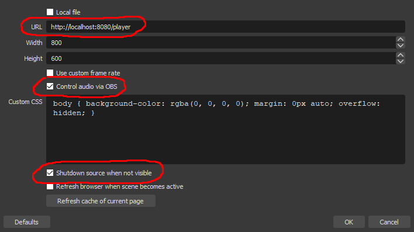
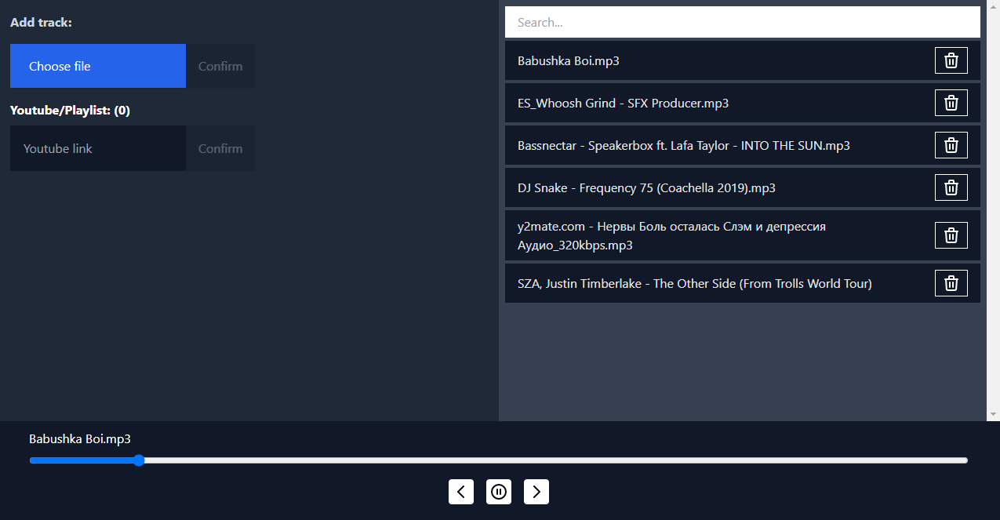

Upload music, control and listen in 1 place

### 1. Build everything:

```bash
npm ci
npm run build:client
```

### 2. Run potato

```bash
npm run dev
```

### 3. Setup

1. Setup obs 

2. Open [http://localhost:4000](http://localhost:4000) 

Music is playing inside OBS, not in the browser.
